# Sistem Akademik Laravel 12

Aplikasi web berbasis Laravel 12 + MySQL untuk mengelola data akademik meliputi Jurusan, Mahasiswa, dan Matakuliah.

## Fitur Utama

### 1. **Authentication (Login)**
- User harus login terlebih dahulu untuk mengakses aplikasi
- Form login dengan validasi
- Middleware auth untuk melindungi semua route CRUD
- Logout functionality

### 2. **Dashboard**
- Menampilkan ringkasan statistik:
  - Total Jurusan
  - Total Mahasiswa
  - Total Matakuliah

### 3. **Manajemen Jurusan**
- Tambah Jurusan baru
- Lihat semua Jurusan dengan pagination
- Edit data Jurusan
- Hapus Jurusan
- Validasi form

### 4. **Manajemen Mahasiswa**
- Tambah Mahasiswa baru
- Lihat semua Mahasiswa dengan relasi Jurusan
- Edit data Mahasiswa
- Hapus Mahasiswa
- Validasi form (NIM unik, Jurusan valid)
- Pagination

### 5. **Manajemen Matakuliah**
- Tambah Matakuliah baru
- Lihat semua Matakuliah dengan relasi Jurusan
- Edit data Matakuliah
- Hapus Matakuliah
- Validasi form (SKS 1-6)
- Pagination

## Struktur Database

### Tabel Jurusan
```
id_jurusan (PK)
nama_jurusan
akreditasi
created_at
updated_at
```

### Tabel Mahasiswa
```
id_mahasiswa (PK)
nim (UNIQUE)
nama
id_jurusan (FK)
created_at
updated_at
```

### Tabel Matakuliah
```
id_matakuliah (PK)
nama_matakuliah
sks
id_jurusan (FK)
created_at
updated_at
```

## Relasi Antar Tabel

1. **Jurusan → Mahasiswa** (One to Many)
   - Satu Jurusan memiliki banyak Mahasiswa
   - Foreign Key: mahasiswa.id_jurusan → jurusan.id_jurusan

2. **Jurusan → Matakuliah** (One to Many)
   - Satu Jurusan memiliki banyak Matakuliah
   - Foreign Key: matakuliah.id_jurusan → jurusan.id_jurusan

3. **Mahasiswa → Jurusan** (Belongs To)
   - Satu Mahasiswa milik satu Jurusan

4. **Matakuliah → Jurusan** (Belongs To)
   - Satu Matakuliah milik satu Jurusan

## Setup & Installation

### Prerequisites
- PHP 8.2+
- MySQL 8.0+
- Composer

### Langkah Instalasi

1. **Clone Repository**
```bash
git clone https://github.com/raffli0/Sistem-Akademik.git
cd Sistem-Akademik
```

2. **Install Dependencies**
```bash
composer install
```

3. **Konfigurasi Environment**
```bash
cp .env.example .env
php artisan key:generate
```

4. **Setup Database di `.env`**
```
DB_CONNECTION=mysql
DB_HOST=127.0.0.1
DB_PORT=3306
DB_DATABASE=sistem_akademik
DB_USERNAME=root
DB_PASSWORD=
```

5. **Buat Database**
```bash
mysql -u root -p
CREATE DATABASE sistem_akademik;
EXIT;
```

6. **Run Migration & Seeding**
```bash
php artisan migrate:fresh --seed
```

7. **Start Development Server**
```bash
php artisan serve
```

8. **Akses Aplikasi**
- URL: `http://localhost:8000`
- Email: `test@example.com`
- Password: `password`

## File Structure

```
app/
├── Http/
│   └── Controllers/
│       ├── DashboardController.php
│       ├── JurusanController.php
│       ├── MahasiswaController.php
│       └── MatakuliahController.php
├── Models/
│   ├── Jurusan.php
│   ├── Mahasiswa.php
│   ├── Matakuliah.php
│   └── User.php

database/
├── migrations/
│   ├── 2026_04_21_073205_create_jurusan_table.php
│   ├── 2026_04_21_073227_create_mahasiswa_table.php
│   └── 2026_04_21_073227_create_matakuliah_table.php
└── seeders/
    ├── DatabaseSeeder.php
    ├── JurusanSeeder.php
    ├── MahasiswaSeeder.php
    └── MatakuliahSeeder.php

resources/
└── views/
    ├── dashboard.blade.php
    ├── layouts/
    │   └── app.blade.php
    ├── auth/
    │   └── login.blade.php
    ├── jurusan/
    │   ├── index.blade.php
    │   ├── create.blade.php
    │   └── edit.blade.php
    ├── mahasiswa/
    │   ├── index.blade.php
    │   ├── create.blade.php
    │   └── edit.blade.php
    └── matakuliah/
        ├── index.blade.php
        ├── create.blade.php
        └── edit.blade.php

routes/
└── web.php
```

## Gallery

### Login Page

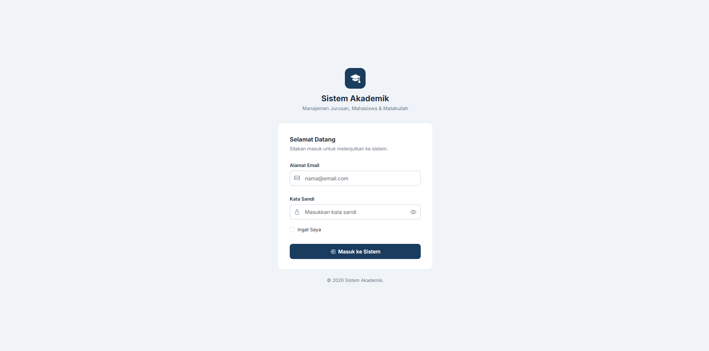

### Dashboard Page

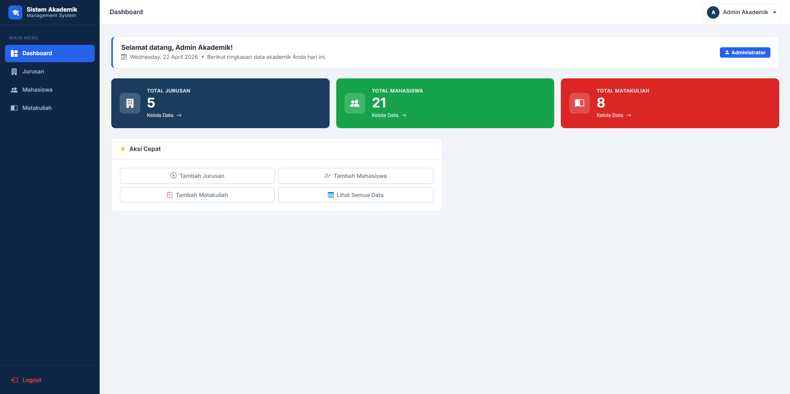

### Jurusan Page

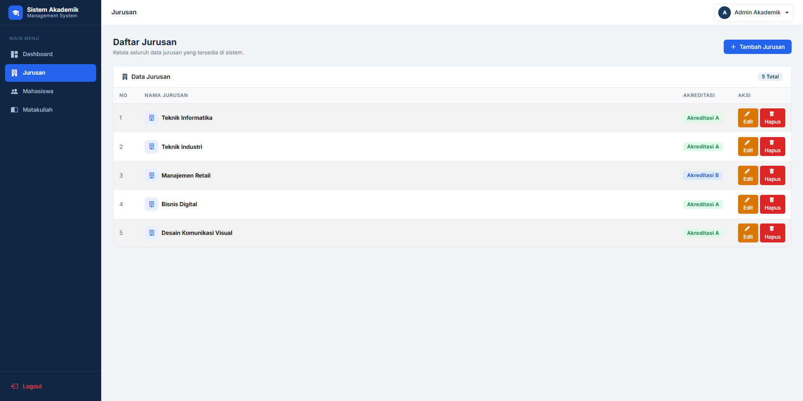

### Jurusan Create Page

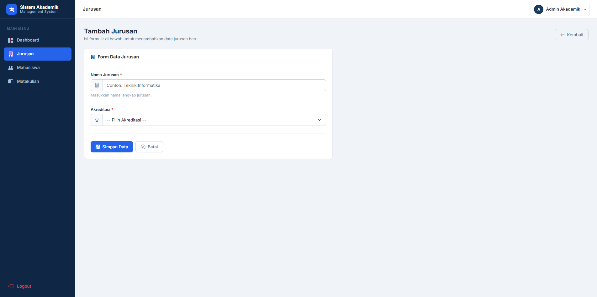

### Jurusan Edit Page

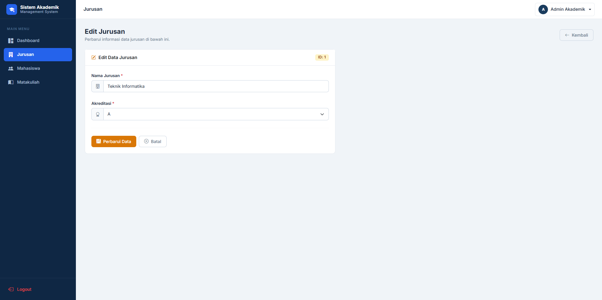

### Mahasiswa Page

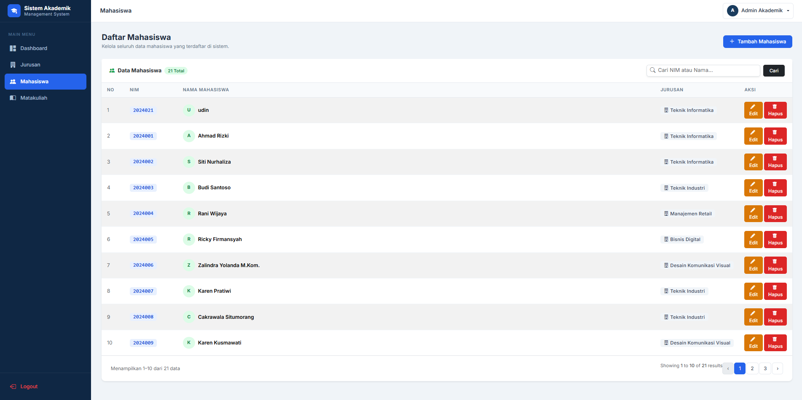

### Mahasiswa Create Page

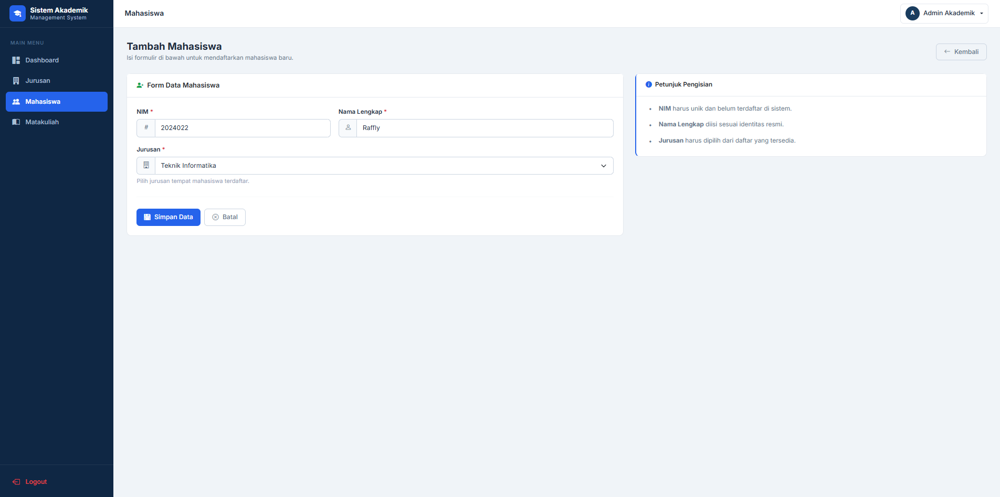

### Mahasiswa Edit Page

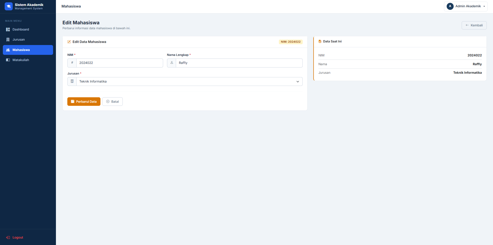

### Matakuliah Page

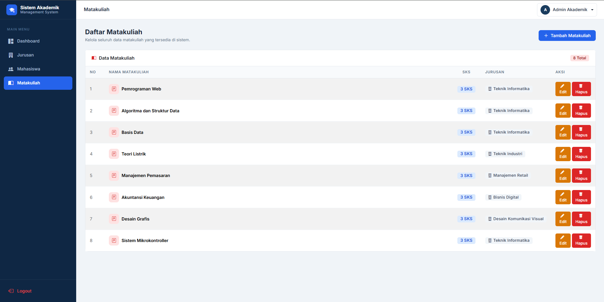

### Matakuliah Create Page

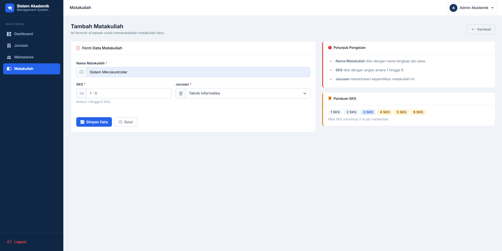

### Matakuliah Edit Page

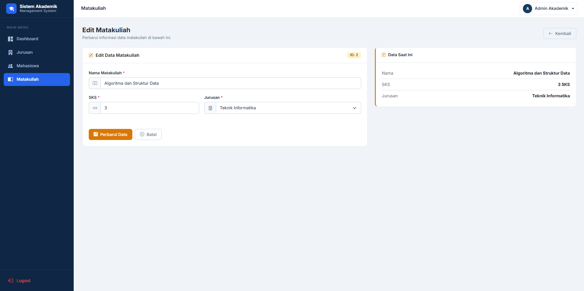


